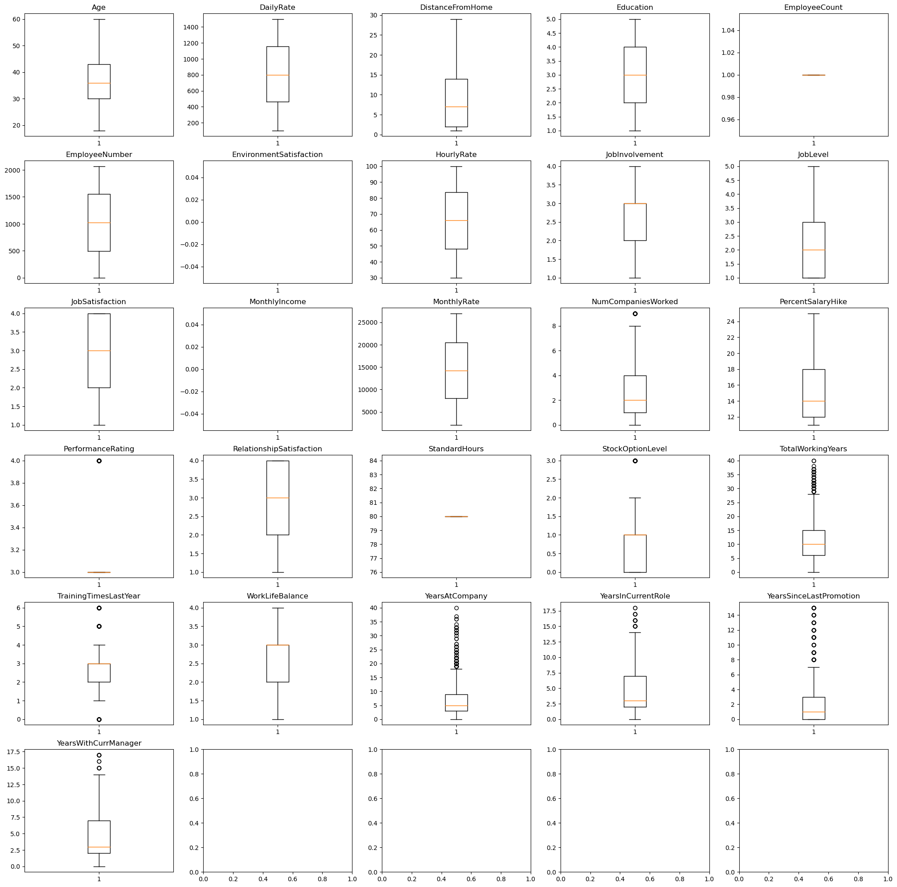
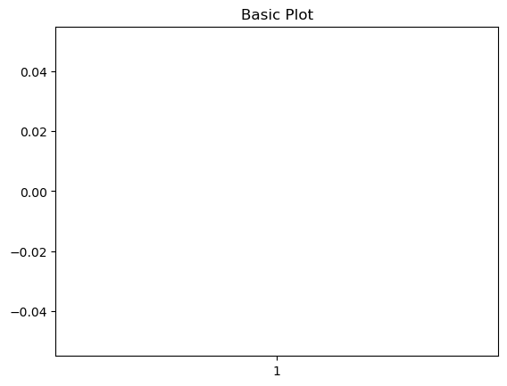
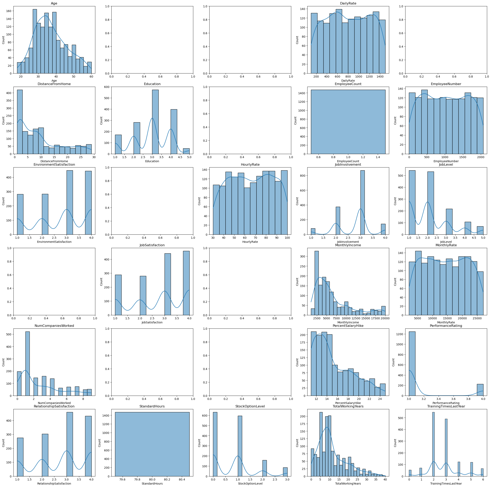

# Partie 1 : Analyse des Données


```python
import numpy as np
import pandas as pd
import matplotlib.pyplot as plt
import seaborn as sns
import warnings
warnings.filterwarnings("ignore")
```

## A) Manipulation de datasets

#### a) importer et visualiser le contenu d'un dataset


```python
df = pd.read_excel("Dataset1_ HR-EmployeeAttrition.xlsx")
df.head()
```


<div>
<style scoped>
    .dataframe tbody tr th:only-of-type {
        vertical-align: middle;
    }

    .dataframe tbody tr th {
        vertical-align: top;
    }

    .dataframe thead th {
        text-align: right;
    }
</style>
<table border="1" class="dataframe">
  <thead>
    <tr style="text-align: right;">
      <th></th>
      <th>Age</th>
      <th>Attrition</th>
      <th>BusinessTravel</th>
      <th>DailyRate</th>
      <th>Department</th>
      <th>DistanceFromHome</th>
      <th>Education</th>
      <th>EducationField</th>
      <th>EmployeeCount</th>
      <th>EmployeeNumber</th>
      <th>...</th>
      <th>RelationshipSatisfaction</th>
      <th>StandardHours</th>
      <th>StockOptionLevel</th>
      <th>TotalWorkingYears</th>
      <th>TrainingTimesLastYear</th>
      <th>WorkLifeBalance</th>
      <th>YearsAtCompany</th>
      <th>YearsInCurrentRole</th>
      <th>YearsSinceLastPromotion</th>
      <th>YearsWithCurrManager</th>
    </tr>
  </thead>
  <tbody>
    <tr>
      <th>0</th>
      <td>41.0</td>
      <td>Yes</td>
      <td>Travel_Rarely</td>
      <td>1102.0</td>
      <td>Sales</td>
      <td>1.0</td>
      <td>2.0</td>
      <td>Life Sciences</td>
      <td>1.0</td>
      <td>1.0</td>
      <td>...</td>
      <td>1.0</td>
      <td>80.0</td>
      <td>0.0</td>
      <td>8.0</td>
      <td>0.0</td>
      <td>1.0</td>
      <td>6.0</td>
      <td>4.0</td>
      <td>0.0</td>
      <td>5.0</td>
    </tr>
    <tr>
      <th>1</th>
      <td>49.0</td>
      <td>No</td>
      <td>Travel_Frequently</td>
      <td>279.0</td>
      <td>Research &amp; Development</td>
      <td>8.0</td>
      <td>1.0</td>
      <td>Life Sciences</td>
      <td>1.0</td>
      <td>2.0</td>
      <td>...</td>
      <td>4.0</td>
      <td>80.0</td>
      <td>1.0</td>
      <td>10.0</td>
      <td>3.0</td>
      <td>3.0</td>
      <td>10.0</td>
      <td>7.0</td>
      <td>1.0</td>
      <td>7.0</td>
    </tr>
    <tr>
      <th>2</th>
      <td>37.0</td>
      <td>Yes</td>
      <td>Travel_Rarely</td>
      <td>1373.0</td>
      <td>Research &amp; Development</td>
      <td>2.0</td>
      <td>2.0</td>
      <td>Other</td>
      <td>1.0</td>
      <td>4.0</td>
      <td>...</td>
      <td>2.0</td>
      <td>80.0</td>
      <td>0.0</td>
      <td>7.0</td>
      <td>3.0</td>
      <td>3.0</td>
      <td>0.0</td>
      <td>0.0</td>
      <td>0.0</td>
      <td>0.0</td>
    </tr>
    <tr>
      <th>3</th>
      <td>33.0</td>
      <td>No</td>
      <td>Travel_Frequently</td>
      <td>1392.0</td>
      <td>Research &amp; Development</td>
      <td>3.0</td>
      <td>4.0</td>
      <td>Life Sciences</td>
      <td>1.0</td>
      <td>5.0</td>
      <td>...</td>
      <td>3.0</td>
      <td>80.0</td>
      <td>0.0</td>
      <td>8.0</td>
      <td>3.0</td>
      <td>3.0</td>
      <td>8.0</td>
      <td>7.0</td>
      <td>3.0</td>
      <td>0.0</td>
    </tr>
    <tr>
      <th>4</th>
      <td>27.0</td>
      <td>No</td>
      <td>Travel_Rarely</td>
      <td>591.0</td>
      <td>Research &amp; Development</td>
      <td>2.0</td>
      <td>1.0</td>
      <td>Medical</td>
      <td>1.0</td>
      <td>7.0</td>
      <td>...</td>
      <td>4.0</td>
      <td>80.0</td>
      <td>1.0</td>
      <td>6.0</td>
      <td>3.0</td>
      <td>3.0</td>
      <td>2.0</td>
      <td>2.0</td>
      <td>2.0</td>
      <td>2.0</td>
    </tr>
  </tbody>
</table>
<p>5 rows × 35 columns</p>
</div>


```python
df.iloc[0,0] =55.0
df.head(8)
```


<div>
<style scoped>
    .dataframe tbody tr th:only-of-type {
        vertical-align: middle;
    }

    .dataframe tbody tr th {
        vertical-align: top;
    }

    .dataframe thead th {
        text-align: right;
    }
</style>
<table border="1" class="dataframe">
  <thead>
    <tr style="text-align: right;">
      <th></th>
      <th>Age</th>
      <th>Attrition</th>
      <th>BusinessTravel</th>
      <th>DailyRate</th>
      <th>Department</th>
      <th>DistanceFromHome</th>
      <th>Education</th>
      <th>EducationField</th>
      <th>EmployeeCount</th>
      <th>EmployeeNumber</th>
      <th>...</th>
      <th>RelationshipSatisfaction</th>
      <th>StandardHours</th>
      <th>StockOptionLevel</th>
      <th>TotalWorkingYears</th>
      <th>TrainingTimesLastYear</th>
      <th>WorkLifeBalance</th>
      <th>YearsAtCompany</th>
      <th>YearsInCurrentRole</th>
      <th>YearsSinceLastPromotion</th>
      <th>YearsWithCurrManager</th>
    </tr>
  </thead>
  <tbody>
    <tr>
      <th>0</th>
      <td>55.0</td>
      <td>Yes</td>
      <td>Travel_Rarely</td>
      <td>1102.0</td>
      <td>Sales</td>
      <td>1.0</td>
      <td>2.0</td>
      <td>Life Sciences</td>
      <td>1.0</td>
      <td>1.0</td>
      <td>...</td>
      <td>1.0</td>
      <td>80.0</td>
      <td>0.0</td>
      <td>8.0</td>
      <td>0.0</td>
      <td>1.0</td>
      <td>6.0</td>
      <td>4.0</td>
      <td>0.0</td>
      <td>5.0</td>
    </tr>
    <tr>
      <th>1</th>
      <td>49.0</td>
      <td>No</td>
      <td>Travel_Frequently</td>
      <td>279.0</td>
      <td>Research &amp; Development</td>
      <td>8.0</td>
      <td>1.0</td>
      <td>Life Sciences</td>
      <td>1.0</td>
      <td>2.0</td>
      <td>...</td>
      <td>4.0</td>
      <td>80.0</td>
      <td>1.0</td>
      <td>10.0</td>
      <td>3.0</td>
      <td>3.0</td>
      <td>10.0</td>
      <td>7.0</td>
      <td>1.0</td>
      <td>7.0</td>
    </tr>
    <tr>
      <th>2</th>
      <td>37.0</td>
      <td>Yes</td>
      <td>Travel_Rarely</td>
      <td>1373.0</td>
      <td>Research &amp; Development</td>
      <td>2.0</td>
      <td>2.0</td>
      <td>Other</td>
      <td>1.0</td>
      <td>4.0</td>
      <td>...</td>
      <td>2.0</td>
      <td>80.0</td>
      <td>0.0</td>
      <td>7.0</td>
      <td>3.0</td>
      <td>3.0</td>
      <td>0.0</td>
      <td>0.0</td>
      <td>0.0</td>
      <td>0.0</td>
    </tr>
    <tr>
      <th>3</th>
      <td>33.0</td>
      <td>No</td>
      <td>Travel_Frequently</td>
      <td>1392.0</td>
      <td>Research &amp; Development</td>
      <td>3.0</td>
      <td>4.0</td>
      <td>Life Sciences</td>
      <td>1.0</td>
      <td>5.0</td>
      <td>...</td>
      <td>3.0</td>
      <td>80.0</td>
      <td>0.0</td>
      <td>8.0</td>
      <td>3.0</td>
      <td>3.0</td>
      <td>8.0</td>
      <td>7.0</td>
      <td>3.0</td>
      <td>0.0</td>
    </tr>
    <tr>
      <th>4</th>
      <td>27.0</td>
      <td>No</td>
      <td>Travel_Rarely</td>
      <td>591.0</td>
      <td>Research &amp; Development</td>
      <td>2.0</td>
      <td>1.0</td>
      <td>Medical</td>
      <td>1.0</td>
      <td>7.0</td>
      <td>...</td>
      <td>4.0</td>
      <td>80.0</td>
      <td>1.0</td>
      <td>6.0</td>
      <td>3.0</td>
      <td>3.0</td>
      <td>2.0</td>
      <td>2.0</td>
      <td>2.0</td>
      <td>2.0</td>
    </tr>
    <tr>
      <th>5</th>
      <td>32.0</td>
      <td>No</td>
      <td>Travel_Frequently</td>
      <td>1005.0</td>
      <td>Research &amp; Development</td>
      <td>2.0</td>
      <td>2.0</td>
      <td>Life Sciences</td>
      <td>1.0</td>
      <td>8.0</td>
      <td>...</td>
      <td>3.0</td>
      <td>80.0</td>
      <td>0.0</td>
      <td>8.0</td>
      <td>2.0</td>
      <td>2.0</td>
      <td>7.0</td>
      <td>7.0</td>
      <td>3.0</td>
      <td>6.0</td>
    </tr>
    <tr>
      <th>6</th>
      <td>59.0</td>
      <td>No</td>
      <td>Travel_Rarely</td>
      <td>1324.0</td>
      <td>Research &amp; Development</td>
      <td>3.0</td>
      <td>3.0</td>
      <td>Medical</td>
      <td>1.0</td>
      <td>10.0</td>
      <td>...</td>
      <td>1.0</td>
      <td>80.0</td>
      <td>3.0</td>
      <td>12.0</td>
      <td>3.0</td>
      <td>2.0</td>
      <td>1.0</td>
      <td>0.0</td>
      <td>0.0</td>
      <td>0.0</td>
    </tr>
    <tr>
      <th>7</th>
      <td>30.0</td>
      <td>No</td>
      <td>Travel_Rarely</td>
      <td>1358.0</td>
      <td>Research &amp; Development</td>
      <td>24.0</td>
      <td>1.0</td>
      <td>Life Sciences</td>
      <td>1.0</td>
      <td>11.0</td>
      <td>...</td>
      <td>2.0</td>
      <td>80.0</td>
      <td>1.0</td>
      <td>1.0</td>
      <td>2.0</td>
      <td>3.0</td>
      <td>1.0</td>
      <td>0.0</td>
      <td>0.0</td>
      <td>0.0</td>
    </tr>
  </tbody>
</table>
<p>8 rows × 35 columns</p>
</div>


#### b) fournir une description globale du dataset


```python
dataset_description = {}
dataset_description["Nombre de lignes"] = df.shape[0]
dataset_description["Nombre de colonnes"] = df.shape[1]
dataset_description["Usage en memoire"] = str(df.memory_usage(index=False).sum() / 1024) + " ko"
dataset_description["Type de donnees"] = list(map(str, df.dtypes.unique().tolist()))
pd.DataFrame.from_dict(dataset_description, orient='index', columns = [""])
```


<div>
<style scoped>
    .dataframe tbody tr th:only-of-type {
        vertical-align: middle;
    }

    .dataframe tbody tr th {
        vertical-align: top;
    }

    .dataframe thead th {
        text-align: right;
    }
</style>
<table border="1" class="dataframe">
  <thead>
    <tr style="text-align: right;">
      <th></th>
      <th></th>
    </tr>
  </thead>
  <tbody>
    <tr>
      <th>Nombre de lignes</th>
      <td>1470</td>
    </tr>
    <tr>
      <th>Nombre de colonnes</th>
      <td>35</td>
    </tr>
    <tr>
      <th>Usage en memoire</th>
      <td>401.953125 ko</td>
    </tr>
    <tr>
      <th>Type de donnees</th>
      <td>[float64, object]</td>
    </tr>
  </tbody>
</table>
</div>


#### c) fournir une description de chaque attribut 


```python
colonnes_description = []
for d in df:
    colonnes_description.append([d, df[d].count(), str(df.dtypes[d])])
pd.DataFrame(colonnes_description, columns = ["Nom","Valeur non null","Type"])
```


<div>
<style scoped>
    .dataframe tbody tr th:only-of-type {
        vertical-align: middle;
    }

    .dataframe tbody tr th {
        vertical-align: top;
    }

    .dataframe thead th {
        text-align: right;
    }
</style>
<table border="1" class="dataframe">
  <thead>
    <tr style="text-align: right;">
      <th></th>
      <th>Nom</th>
      <th>Valeur non null</th>
      <th>Type</th>
    </tr>
  </thead>
  <tbody>
    <tr>
      <th>0</th>
      <td>Age</td>
      <td>1470</td>
      <td>float64</td>
    </tr>
    <tr>
      <th>1</th>
      <td>Attrition</td>
      <td>1470</td>
      <td>object</td>
    </tr>
    <tr>
      <th>2</th>
      <td>BusinessTravel</td>
      <td>1470</td>
      <td>object</td>
    </tr>
    <tr>
      <th>3</th>
      <td>DailyRate</td>
      <td>1470</td>
      <td>float64</td>
    </tr>
    <tr>
      <th>4</th>
      <td>Department</td>
      <td>1470</td>
      <td>object</td>
    </tr>
    <tr>
      <th>5</th>
      <td>DistanceFromHome</td>
      <td>1470</td>
      <td>float64</td>
    </tr>
    <tr>
      <th>6</th>
      <td>Education</td>
      <td>1470</td>
      <td>float64</td>
    </tr>
    <tr>
      <th>7</th>
      <td>EducationField</td>
      <td>1470</td>
      <td>object</td>
    </tr>
    <tr>
      <th>8</th>
      <td>EmployeeCount</td>
      <td>1470</td>
      <td>float64</td>
    </tr>
    <tr>
      <th>9</th>
      <td>EmployeeNumber</td>
      <td>1470</td>
      <td>float64</td>
    </tr>
    <tr>
      <th>10</th>
      <td>EnvironmentSatisfaction</td>
      <td>1457</td>
      <td>float64</td>
    </tr>
    <tr>
      <th>11</th>
      <td>Gender</td>
      <td>1470</td>
      <td>object</td>
    </tr>
    <tr>
      <th>12</th>
      <td>HourlyRate</td>
      <td>1470</td>
      <td>float64</td>
    </tr>
    <tr>
      <th>13</th>
      <td>JobInvolvement</td>
      <td>1470</td>
      <td>float64</td>
    </tr>
    <tr>
      <th>14</th>
      <td>JobLevel</td>
      <td>1470</td>
      <td>float64</td>
    </tr>
    <tr>
      <th>15</th>
      <td>JobRole</td>
      <td>1470</td>
      <td>object</td>
    </tr>
    <tr>
      <th>16</th>
      <td>JobSatisfaction</td>
      <td>1470</td>
      <td>float64</td>
    </tr>
    <tr>
      <th>17</th>
      <td>MaritalStatus</td>
      <td>1470</td>
      <td>object</td>
    </tr>
    <tr>
      <th>18</th>
      <td>MonthlyIncome</td>
      <td>1462</td>
      <td>float64</td>
    </tr>
    <tr>
      <th>19</th>
      <td>MonthlyRate</td>
      <td>1470</td>
      <td>float64</td>
    </tr>
    <tr>
      <th>20</th>
      <td>NumCompaniesWorked</td>
      <td>1470</td>
      <td>float64</td>
    </tr>
    <tr>
      <th>21</th>
      <td>Over18</td>
      <td>1470</td>
      <td>object</td>
    </tr>
    <tr>
      <th>22</th>
      <td>OverTime</td>
      <td>1470</td>
      <td>object</td>
    </tr>
    <tr>
      <th>23</th>
      <td>PercentSalaryHike</td>
      <td>1470</td>
      <td>float64</td>
    </tr>
    <tr>
      <th>24</th>
      <td>PerformanceRating</td>
      <td>1470</td>
      <td>float64</td>
    </tr>
    <tr>
      <th>25</th>
      <td>RelationshipSatisfaction</td>
      <td>1470</td>
      <td>float64</td>
    </tr>
    <tr>
      <th>26</th>
      <td>StandardHours</td>
      <td>1470</td>
      <td>float64</td>
    </tr>
    <tr>
      <th>27</th>
      <td>StockOptionLevel</td>
      <td>1470</td>
      <td>float64</td>
    </tr>
    <tr>
      <th>28</th>
      <td>TotalWorkingYears</td>
      <td>1470</td>
      <td>float64</td>
    </tr>
    <tr>
      <th>29</th>
      <td>TrainingTimesLastYear</td>
      <td>1470</td>
      <td>float64</td>
    </tr>
    <tr>
      <th>30</th>
      <td>WorkLifeBalance</td>
      <td>1470</td>
      <td>float64</td>
    </tr>
    <tr>
      <th>31</th>
      <td>YearsAtCompany</td>
      <td>1470</td>
      <td>float64</td>
    </tr>
    <tr>
      <th>32</th>
      <td>YearsInCurrentRole</td>
      <td>1470</td>
      <td>float64</td>
    </tr>
    <tr>
      <th>33</th>
      <td>YearsSinceLastPromotion</td>
      <td>1470</td>
      <td>float64</td>
    </tr>
    <tr>
      <th>34</th>
      <td>YearsWithCurrManager</td>
      <td>1470</td>
      <td>float64</td>
    </tr>
  </tbody>
</table>
</div>


## B) Analyse des caractéristiques des attributs du dataset sélectionné

#### a.i) Calculer les mesures de tendance centrale et en déduire les symétries


```python
def moyenne(df, d):
    return float("{:.2f}".format(df[d].sum() / df[d].count()))

def median(df, d): 
    colonne_sorted = list(df[d].sort_values())
    n = len(df[d])
    return ((colonne_sorted[n//2] + colonne_sorted[n//2 + 1]) / 2) if n % 2 == 0 else colonne_sorted[(n+1)/2]

def mode(df, d):
    l = []
    l.append(df[d].value_counts().index)
    l.append(list(df[d].value_counts()))
    mod = [l[0][0]]
    for i in range(1, len(l[0])):
        if l[1][i] == l[1][0]:
            mod.append(l[0][i])
        else:
            break
    return mod if len(mod) > 1 else [] if len(mod) == len(df[d]) else mod[0]

def coeff_asy(tc):
    mode = max(tc["Mode"]) if type(tc["Mode"]) == list else tc["Mode"]

    if round(tc["Moyenne"]) == round(tc["Mediane"]) == round(mode):
        return "Distribution symetrique"
    elif tc["Moyenne"] < tc["Mediane"] < mode:
        return "Distribution d'asymetrie negative"
    elif tc["Moyenne"] > tc["Mediane"] > mode:
        return "Distribution d'asymetrie positive"
    else:
        return "Distribution non identifie"

```


```python
from pandas.api.types import is_numeric_dtype
tendance_centrale = {}
for d in df:
    tc = {}
    if is_numeric_dtype(df[d]):
        tc["Moyenne"] = moyenne(df, d)
        tc["Mediane"] = median(df, d)
        tc["Mode"] = mode(df, d)
        tc["symetrie"] = coeff_asy(tc)
        tendance_centrale[d] = tc
pd.DataFrame.from_dict(tendance_centrale, orient='index')
```


<div>
<style scoped>
    .dataframe tbody tr th:only-of-type {
        vertical-align: middle;
    }

    .dataframe tbody tr th {
        vertical-align: top;
    }

    .dataframe thead th {
        text-align: right;
    }
</style>
<table border="1" class="dataframe">
  <thead>
    <tr style="text-align: right;">
      <th></th>
      <th>Moyenne</th>
      <th>Mediane</th>
      <th>Mode</th>
      <th>symetrie</th>
    </tr>
  </thead>
  <tbody>
    <tr>
      <th>Age</th>
      <td>36.93</td>
      <td>36.0</td>
      <td>35.0</td>
      <td>Distribution d'asymetrie positive</td>
    </tr>
    <tr>
      <th>DailyRate</th>
      <td>802.49</td>
      <td>803.0</td>
      <td>691.0</td>
      <td>Distribution non identifie</td>
    </tr>
    <tr>
      <th>DistanceFromHome</th>
      <td>9.19</td>
      <td>7.0</td>
      <td>2.0</td>
      <td>Distribution d'asymetrie positive</td>
    </tr>
    <tr>
      <th>Education</th>
      <td>2.91</td>
      <td>3.0</td>
      <td>3.0</td>
      <td>Distribution symetrique</td>
    </tr>
    <tr>
      <th>EmployeeCount</th>
      <td>1.00</td>
      <td>1.0</td>
      <td>1.0</td>
      <td>Distribution symetrique</td>
    </tr>
    <tr>
      <th>EmployeeNumber</th>
      <td>1024.87</td>
      <td>1023.0</td>
      <td>[1.0, 1391.0, 1389.0, 1387.0, 1383.0, 1382.0, ...</td>
      <td>Distribution non identifie</td>
    </tr>
    <tr>
      <th>EnvironmentSatisfaction</th>
      <td>2.72</td>
      <td>3.0</td>
      <td>3.0</td>
      <td>Distribution symetrique</td>
    </tr>
    <tr>
      <th>HourlyRate</th>
      <td>65.89</td>
      <td>66.0</td>
      <td>66.0</td>
      <td>Distribution symetrique</td>
    </tr>
    <tr>
      <th>JobInvolvement</th>
      <td>2.73</td>
      <td>3.0</td>
      <td>3.0</td>
      <td>Distribution symetrique</td>
    </tr>
    <tr>
      <th>JobLevel</th>
      <td>2.06</td>
      <td>2.0</td>
      <td>1.0</td>
      <td>Distribution d'asymetrie positive</td>
    </tr>
    <tr>
      <th>JobSatisfaction</th>
      <td>2.73</td>
      <td>3.0</td>
      <td>4.0</td>
      <td>Distribution d'asymetrie negative</td>
    </tr>
    <tr>
      <th>MonthlyIncome</th>
      <td>6517.65</td>
      <td>4961.5</td>
      <td>2342.0</td>
      <td>Distribution d'asymetrie positive</td>
    </tr>
    <tr>
      <th>MonthlyRate</th>
      <td>14313.10</td>
      <td>14248.5</td>
      <td>[4223.0, 9150.0]</td>
      <td>Distribution d'asymetrie positive</td>
    </tr>
    <tr>
      <th>NumCompaniesWorked</th>
      <td>2.69</td>
      <td>2.0</td>
      <td>1.0</td>
      <td>Distribution d'asymetrie positive</td>
    </tr>
    <tr>
      <th>PercentSalaryHike</th>
      <td>15.21</td>
      <td>14.0</td>
      <td>11.0</td>
      <td>Distribution d'asymetrie positive</td>
    </tr>
    <tr>
      <th>PerformanceRating</th>
      <td>3.15</td>
      <td>3.0</td>
      <td>3.0</td>
      <td>Distribution symetrique</td>
    </tr>
    <tr>
      <th>RelationshipSatisfaction</th>
      <td>2.71</td>
      <td>3.0</td>
      <td>3.0</td>
      <td>Distribution symetrique</td>
    </tr>
    <tr>
      <th>StandardHours</th>
      <td>80.00</td>
      <td>80.0</td>
      <td>80.0</td>
      <td>Distribution symetrique</td>
    </tr>
    <tr>
      <th>StockOptionLevel</th>
      <td>0.79</td>
      <td>1.0</td>
      <td>0.0</td>
      <td>Distribution non identifie</td>
    </tr>
    <tr>
      <th>TotalWorkingYears</th>
      <td>11.28</td>
      <td>10.0</td>
      <td>10.0</td>
      <td>Distribution non identifie</td>
    </tr>
    <tr>
      <th>TrainingTimesLastYear</th>
      <td>2.80</td>
      <td>3.0</td>
      <td>2.0</td>
      <td>Distribution non identifie</td>
    </tr>
    <tr>
      <th>WorkLifeBalance</th>
      <td>2.76</td>
      <td>3.0</td>
      <td>3.0</td>
      <td>Distribution symetrique</td>
    </tr>
    <tr>
      <th>YearsAtCompany</th>
      <td>7.01</td>
      <td>5.0</td>
      <td>5.0</td>
      <td>Distribution non identifie</td>
    </tr>
    <tr>
      <th>YearsInCurrentRole</th>
      <td>4.23</td>
      <td>3.0</td>
      <td>2.0</td>
      <td>Distribution d'asymetrie positive</td>
    </tr>
    <tr>
      <th>YearsSinceLastPromotion</th>
      <td>2.19</td>
      <td>1.0</td>
      <td>0.0</td>
      <td>Distribution d'asymetrie positive</td>
    </tr>
    <tr>
      <th>YearsWithCurrManager</th>
      <td>4.12</td>
      <td>3.0</td>
      <td>2.0</td>
      <td>Distribution d'asymetrie positive</td>
    </tr>
  </tbody>
</table>
</div>


#### a.ii) Calculer les mesures de dispersion et en déduire les données aberrantes


```python
def ecart_moyen(df, d):
    em = []
    m = moyenne(df, d)
    for d in df[d]:
        em.append(float("{:.2f}".format(np.abs(d-m))))
    return em

def variance(df, d):
    em_sum = []
    m = moyenne(df, d)
    n = len(df[d])
    for d in df[d]:
        em_sum.append(np.power((d - m), 2))
    return float("{:.2f}".format(sum(em_sum) / n))

def ecart_type(var):
    return float("{:.2f}".format(np.sqrt(var)))

def quartilles(df, d):
    colonne_sorted = list(df[d].sort_values())
    n = len(df[d])
    return [min(colonne_sorted), colonne_sorted[n // 4], colonne_sorted[(n * 3) // 4], max(colonne_sorted)]

def iqr(quart):
    return quart[2] - quart[1] 

```


```python
from pandas.api.types import is_numeric_dtype
mesures_de_dispersion = {}
for d in df:
    mdd = {}
    if is_numeric_dtype(df[d]):
        em = ecart_moyen(df, d)
        mdd["Ecart moyen"] = [min(em), max(em)]
        mdd["Variance"] = median(df, d)
        mdd["Ecart type"] = ecart_type(mdd["Variance"])
        quart = quartilles(df, d)
        quart_name = ["Minimum", "Q1", "Q3", "Maximum"]
        for q, qm in zip(quart, quart_name):
            mdd[qm] = q
        mdd["IQR"] = iqr(quart)
        Outliers = [x for x in df[d] if (x > (mdd["Q3"] + 1.5 * mdd["IQR"])) or (x < (mdd["Q1"] - 1.5 * mdd["IQR"]))]
        mdd["Donnees aberanttes"] = "Aucune" if len(Outliers) == 0 else set(Outliers)
        mesures_de_dispersion[d] = mdd
pd.DataFrame.from_dict(mesures_de_dispersion, orient='index')
```


<div>
<style scoped>
    .dataframe tbody tr th:only-of-type {
        vertical-align: middle;
    }

    .dataframe tbody tr th {
        vertical-align: top;
    }

    .dataframe thead th {
        text-align: right;
    }
</style>
<table border="1" class="dataframe">
  <thead>
    <tr style="text-align: right;">
      <th></th>
      <th>Ecart moyen</th>
      <th>Variance</th>
      <th>Ecart type</th>
      <th>Minimum</th>
      <th>Q1</th>
      <th>Q3</th>
      <th>Maximum</th>
      <th>IQR</th>
      <th>Donnees aberanttes</th>
    </tr>
  </thead>
  <tbody>
    <tr>
      <th>Age</th>
      <td>[0.07, 23.07]</td>
      <td>36.0</td>
      <td>6.00</td>
      <td>18.0</td>
      <td>30.0</td>
      <td>43.0</td>
      <td>60.0</td>
      <td>13.0</td>
      <td>Aucune</td>
    </tr>
    <tr>
      <th>DailyRate</th>
      <td>[0.49, 700.49]</td>
      <td>803.0</td>
      <td>28.34</td>
      <td>102.0</td>
      <td>465.0</td>
      <td>1157.0</td>
      <td>1499.0</td>
      <td>692.0</td>
      <td>Aucune</td>
    </tr>
    <tr>
      <th>DistanceFromHome</th>
      <td>[0.19, 19.81]</td>
      <td>7.0</td>
      <td>2.65</td>
      <td>1.0</td>
      <td>2.0</td>
      <td>14.0</td>
      <td>29.0</td>
      <td>12.0</td>
      <td>Aucune</td>
    </tr>
    <tr>
      <th>Education</th>
      <td>[0.09, 2.09]</td>
      <td>3.0</td>
      <td>1.73</td>
      <td>1.0</td>
      <td>2.0</td>
      <td>4.0</td>
      <td>5.0</td>
      <td>2.0</td>
      <td>Aucune</td>
    </tr>
    <tr>
      <th>EmployeeCount</th>
      <td>[0.0, 0.0]</td>
      <td>1.0</td>
      <td>1.00</td>
      <td>1.0</td>
      <td>1.0</td>
      <td>1.0</td>
      <td>1.0</td>
      <td>0.0</td>
      <td>Aucune</td>
    </tr>
    <tr>
      <th>EmployeeNumber</th>
      <td>[0.13, 1043.13]</td>
      <td>1023.0</td>
      <td>31.98</td>
      <td>1.0</td>
      <td>491.0</td>
      <td>1556.0</td>
      <td>2068.0</td>
      <td>1065.0</td>
      <td>Aucune</td>
    </tr>
    <tr>
      <th>EnvironmentSatisfaction</th>
      <td>[0.28, 1.72]</td>
      <td>3.0</td>
      <td>1.73</td>
      <td>1.0</td>
      <td>2.0</td>
      <td>4.0</td>
      <td>4.0</td>
      <td>2.0</td>
      <td>Aucune</td>
    </tr>
    <tr>
      <th>HourlyRate</th>
      <td>[0.11, 35.89]</td>
      <td>66.0</td>
      <td>8.12</td>
      <td>30.0</td>
      <td>48.0</td>
      <td>84.0</td>
      <td>100.0</td>
      <td>36.0</td>
      <td>Aucune</td>
    </tr>
    <tr>
      <th>JobInvolvement</th>
      <td>[0.27, 1.73]</td>
      <td>3.0</td>
      <td>1.73</td>
      <td>1.0</td>
      <td>2.0</td>
      <td>3.0</td>
      <td>4.0</td>
      <td>1.0</td>
      <td>Aucune</td>
    </tr>
    <tr>
      <th>JobLevel</th>
      <td>[0.06, 2.94]</td>
      <td>2.0</td>
      <td>1.41</td>
      <td>1.0</td>
      <td>1.0</td>
      <td>3.0</td>
      <td>5.0</td>
      <td>2.0</td>
      <td>Aucune</td>
    </tr>
    <tr>
      <th>JobSatisfaction</th>
      <td>[0.27, 1.73]</td>
      <td>3.0</td>
      <td>1.73</td>
      <td>1.0</td>
      <td>2.0</td>
      <td>4.0</td>
      <td>4.0</td>
      <td>2.0</td>
      <td>Aucune</td>
    </tr>
    <tr>
      <th>MonthlyIncome</th>
      <td>[1.65, 13481.35]</td>
      <td>4961.5</td>
      <td>70.44</td>
      <td>1009.0</td>
      <td>2933.0</td>
      <td>8500.0</td>
      <td>19999.0</td>
      <td>5567.0</td>
      <td>{18947.0, 17924.0, 19973.0, 17426.0, 19999.0, ...</td>
    </tr>
    <tr>
      <th>MonthlyRate</th>
      <td>[18.1, 12685.9]</td>
      <td>14248.5</td>
      <td>119.37</td>
      <td>2094.0</td>
      <td>8045.0</td>
      <td>20462.0</td>
      <td>26999.0</td>
      <td>12417.0</td>
      <td>Aucune</td>
    </tr>
    <tr>
      <th>NumCompaniesWorked</th>
      <td>[0.31, 6.31]</td>
      <td>2.0</td>
      <td>1.41</td>
      <td>0.0</td>
      <td>1.0</td>
      <td>4.0</td>
      <td>9.0</td>
      <td>3.0</td>
      <td>{9.0}</td>
    </tr>
    <tr>
      <th>PercentSalaryHike</th>
      <td>[0.21, 9.79]</td>
      <td>14.0</td>
      <td>3.74</td>
      <td>11.0</td>
      <td>12.0</td>
      <td>18.0</td>
      <td>25.0</td>
      <td>6.0</td>
      <td>Aucune</td>
    </tr>
    <tr>
      <th>PerformanceRating</th>
      <td>[0.15, 0.85]</td>
      <td>3.0</td>
      <td>1.73</td>
      <td>3.0</td>
      <td>3.0</td>
      <td>3.0</td>
      <td>4.0</td>
      <td>0.0</td>
      <td>{4.0}</td>
    </tr>
    <tr>
      <th>RelationshipSatisfaction</th>
      <td>[0.29, 1.71]</td>
      <td>3.0</td>
      <td>1.73</td>
      <td>1.0</td>
      <td>2.0</td>
      <td>4.0</td>
      <td>4.0</td>
      <td>2.0</td>
      <td>Aucune</td>
    </tr>
    <tr>
      <th>StandardHours</th>
      <td>[0.0, 0.0]</td>
      <td>80.0</td>
      <td>8.94</td>
      <td>80.0</td>
      <td>80.0</td>
      <td>80.0</td>
      <td>80.0</td>
      <td>0.0</td>
      <td>Aucune</td>
    </tr>
    <tr>
      <th>StockOptionLevel</th>
      <td>[0.21, 2.21]</td>
      <td>1.0</td>
      <td>1.00</td>
      <td>0.0</td>
      <td>0.0</td>
      <td>1.0</td>
      <td>3.0</td>
      <td>1.0</td>
      <td>{3.0}</td>
    </tr>
    <tr>
      <th>TotalWorkingYears</th>
      <td>[0.28, 28.72]</td>
      <td>10.0</td>
      <td>3.16</td>
      <td>0.0</td>
      <td>6.0</td>
      <td>15.0</td>
      <td>40.0</td>
      <td>9.0</td>
      <td>{32.0, 33.0, 34.0, 35.0, 36.0, 37.0, 38.0, 40....</td>
    </tr>
    <tr>
      <th>TrainingTimesLastYear</th>
      <td>[0.2, 3.2]</td>
      <td>3.0</td>
      <td>1.73</td>
      <td>0.0</td>
      <td>2.0</td>
      <td>3.0</td>
      <td>6.0</td>
      <td>1.0</td>
      <td>{0.0, 5.0, 6.0}</td>
    </tr>
    <tr>
      <th>WorkLifeBalance</th>
      <td>[0.24, 1.76]</td>
      <td>3.0</td>
      <td>1.73</td>
      <td>1.0</td>
      <td>2.0</td>
      <td>3.0</td>
      <td>4.0</td>
      <td>1.0</td>
      <td>Aucune</td>
    </tr>
    <tr>
      <th>YearsAtCompany</th>
      <td>[0.01, 32.99]</td>
      <td>5.0</td>
      <td>2.24</td>
      <td>0.0</td>
      <td>3.0</td>
      <td>9.0</td>
      <td>40.0</td>
      <td>6.0</td>
      <td>{32.0, 33.0, 34.0, 36.0, 37.0, 40.0, 19.0, 20....</td>
    </tr>
    <tr>
      <th>YearsInCurrentRole</th>
      <td>[0.23, 13.77]</td>
      <td>3.0</td>
      <td>1.73</td>
      <td>0.0</td>
      <td>2.0</td>
      <td>7.0</td>
      <td>18.0</td>
      <td>5.0</td>
      <td>{16.0, 17.0, 18.0, 15.0}</td>
    </tr>
    <tr>
      <th>YearsSinceLastPromotion</th>
      <td>[0.19, 12.81]</td>
      <td>1.0</td>
      <td>1.00</td>
      <td>0.0</td>
      <td>0.0</td>
      <td>3.0</td>
      <td>15.0</td>
      <td>3.0</td>
      <td>{8.0, 9.0, 10.0, 11.0, 12.0, 13.0, 14.0, 15.0}</td>
    </tr>
    <tr>
      <th>YearsWithCurrManager</th>
      <td>[0.12, 12.88]</td>
      <td>3.0</td>
      <td>1.73</td>
      <td>0.0</td>
      <td>2.0</td>
      <td>7.0</td>
      <td>17.0</td>
      <td>5.0</td>
      <td>{16.0, 17.0, 15.0}</td>
    </tr>
  </tbody>
</table>
</div>


#### a.iii) Construire une boite à moustache et afficher les données aberrantes


```python
fig, axes = plt.subplots(6, 5,figsize=(25, 25))
i = 0
j = 0
for d in df:
    if is_numeric_dtype(df[d]):
        axes[i, j].boxplot(df[d])
        axes[i, j].set_title(d)
        j += 1
        if j == 5:
            j = 0
            i += 1

plt.show()
```





```python
fig1, ax1 = plt.subplots()
ax1.set_title('Basic Plot')
ax1.boxplot(df.TrainingTimesLastYear)
```


    {'whiskers': [<matplotlib.lines.Line2D at 0x1915ae11048>,
      <matplotlib.lines.Line2D at 0x1915ae11608>],
     'caps': [<matplotlib.lines.Line2D at 0x1915ae116c8>,
      <matplotlib.lines.Line2D at 0x1915ae11d48>],
     'boxes': [<matplotlib.lines.Line2D at 0x1915ae08b08>],
     'medians': [<matplotlib.lines.Line2D at 0x1915ae18488>],
     'fliers': [<matplotlib.lines.Line2D at 0x1915ae18948>],
     'means': []}





#### a.iv) Construire un histogramme et visualiser la distribution des données


```python
fig, axes = plt.subplots(6, 5,figsize=(30, 30))

for d, ax in zip(df, axes.ravel()):
    if is_numeric_dtype(df[d]):
        sns.histplot(data = df[d], kde=True, ax=ax).set(title=d)

plt.show()
```





#### b) Construire et afficher des diagrammes de dispersion des données et en déduire les corrélations entre les attributs


```python
fig, axes = plt.subplots(5, 5,figsize=(25, 25))
k = 0
j = 0
dd = df.columns.tolist()
dd = [d for d in dd if is_numeric_dtype(df[d])]
dd = list(zip(dd, dd[1:]))
for d in dd:
    if is_numeric_dtype(df[d[0]]) and is_numeric_dtype(df[d[1]]):
        axes[k, j].scatter(df[d[0]], df[d[1]])
        axes[k, j].set_title(d[0] + " & "+ d[1])
        j += 1
        if j == 5:
            j = 0
            k += 1

plt.show()
```


```python

```
